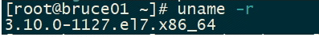

# Docker安装部署

## 一 检查环境

```shell
#查看系统内核
uname -r
```



```shell
#查看系统版本
cat /etc/os-release
```


## 二 安装Docker

### 1.卸载旧版本

```shell
yum remove docker \
                  docker-client \
                  docker-client-latest \
                  docker-common \
                  docker-latest \
                  docker-latest-logrotate \
                  docker-logrotate \
                  docker-engine
```


### 2.下载需要的安装包

```shell
yum install -y yum-utils
```

### 3.设置镜像的仓库

```shell
yum-config-manager \
--add-repo \
https://download.docker.com/linux/centos/docker-ce.repo      
 （默认国外的仓库） 
 
 yum-config-manager \ 
 --add-repo \ 
 http://mirrors.aliyun.com/docker-ce/linux/centos/docker-ce.repo
 （推荐使用阿里云镜像）
```

### 4.更新yum包索引

```shell
yum makecache fast
```

### 5.安装docker

```shell
# ce社区版 ee企业版
yum install docker-ce docker-ce-cli containerd.io（这是最新的版本）
如果下载别的版本
#查看版本
yum list docker-ce --showduplicates | sort -r
#下载某一版本
yum install docker-ce-<VERSION_STRING> docker-ce-cli-<VERSION_STRING> containerd.io
```

### 6.启动docker

```shell
systemctl start docker
```

### 7.查看版本

```shell
docker version
```

### 8.查看镜像

```shell
docker images
```


## 三 配置阿里云镜像加速器

配置阿里云镜像加速器，在docker pull镜像时，比在官网下载快不少

打开阿里云 ===》容器服务 ===》容器镜像服务 ===》镜像加速器 ===》centos ===》复制执行


```shell
sudo mkdir -p /etc/docker
sudo tee /etc/docker/daemon.json <<-'EOF'
{
  "registry-mirrors": ["https://vayauu8j.mirror.aliyuncs.com"]
}
EOF
sudo systemctl daemon-reload
sudo systemctl restart docker
```


## 四 卸载docker

### 1.卸载依赖

```shell
yum remove docker-ce docker-ce-cli containerd.io
```

### 2.删除资源

```
rm -rf /var/lib/docker
rm -rf /var/lib/containerd
```

