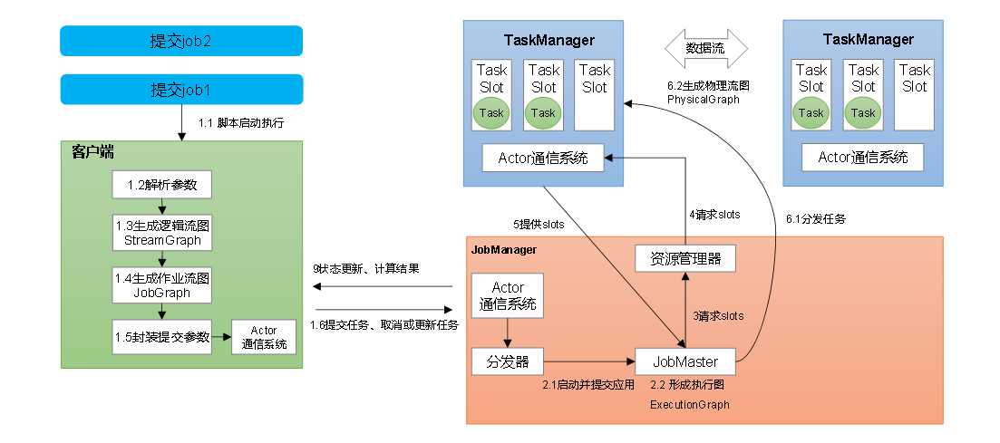
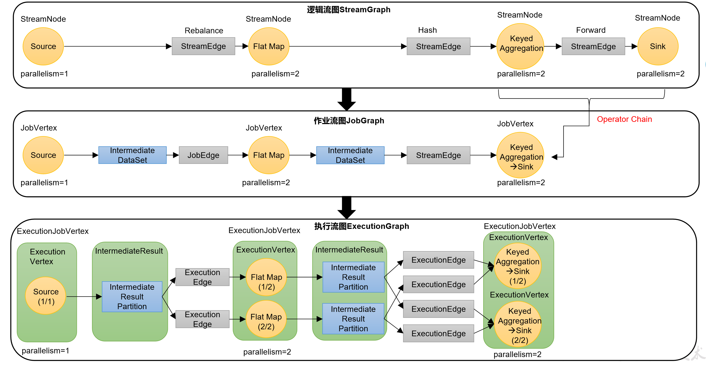
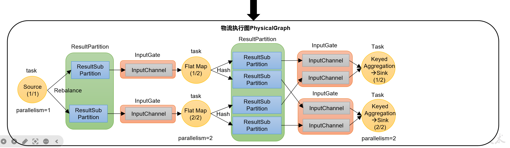

# flink运行时架构-作业提交流程

## 一 Standalone 会话模式作业提交流程

## 二 逻辑流图/作业图/执行图/物理流图

**逻辑流图/作业图/执行图/物理流图**

### 2.1 逻辑流图（StreamGraph）

根据用户通过DataStream API编写的代码生成的最初的DAG图，用来表示程序的拓扑结构。一般在**客户端生成**。

### 2.2 作业图（JobGraph）

StreamGraph经过优化后生成的就是作业图（JobGraph），这是提交给JobManager的数据结构，确定了当前作业中所有任务的划分。主要的优化为：将多个符合条件的节点链接在一起合并成一个任务节点，形成算子链，这样减少数据交换的消耗。JobGraph一般也是在客户端生成的，在作业提交时传递给JobManager.

提交作业后，打开Flink自带的Web UI,点击作业就能看到对应的作业图。

### 2.3 执行图（ExecutionGraph）

JobMaster收到JobGraph后，会根据它来生成执行图（ExecutionGraph）。ExecutionGraph是JobGraph的并行化版本，是调度层最核心的数据结构。与JobGraph最大的区别就是**按照并行度对并行子任务进行了拆分**，并明确了任务间数据传输的方式。

### 2.4 物理图（PhysicalGraph）

JobMaster生成执行图后，会将它分发给TaskManager；各个TaskManager会根据执行图部署任务，最终的物理执行过程也会形成一张“图”，一般就叫作物理图（Physical Graph）。这只是具体执行层面的图，并不是一个具体的数据结构。

物理图主要就是在执行图的基础上，进一步确定数据存放的位置和收发的具体方式。有了物理图，TaskManager就可以对传递来的数据进行处理计算了。

## 三 Yarn应用模式作业提交流程

1）当执行命令run-application命令时，向yarn的RM发起请求，选择一个NodeManager在其上启动ApplicationMaster,相当于Per-job模式中的flinkJobManager.

2）此时，启动分发器，启动资源管理器，分发器启动JobMaster.

3）JobMaster中生成逻辑流图，作业流图，执行流图，然后向资源管理器注册，请求slot

4）资源管理器向ResourceManager申请资源，resouceManager在NodeManager上启动TaskManager，并将task slot向资源管理器注册

5）资源管理器向任务分配slot

6）TaskManager提供slot,jobMaster分配任务，最后taskManager生成物理流图
