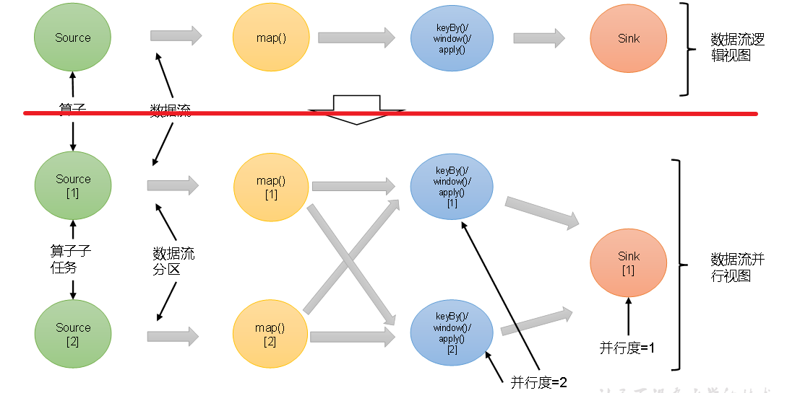
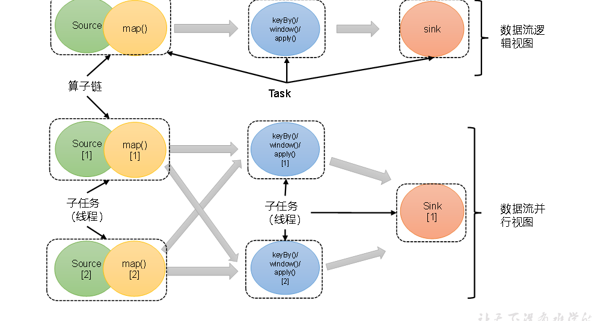
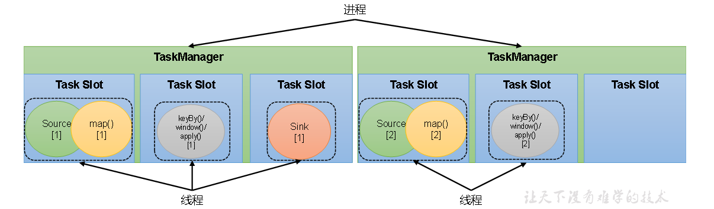
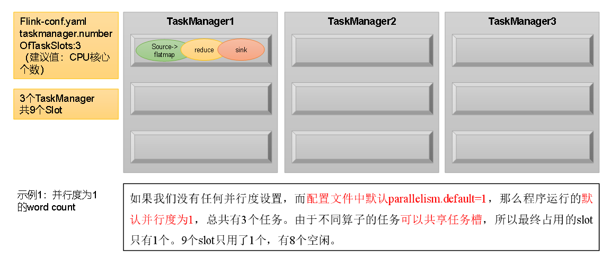
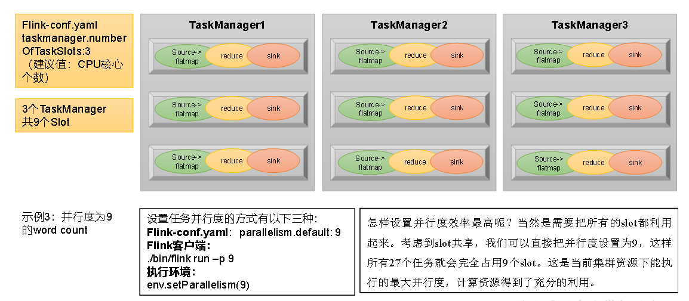

# flink运行时架构-核心概念

## 一 并行度（Parallelism）

### 1.1 并行子任务和并行度

当要处理的数据量非常大时，我们可以把一个算子操作，“复制”多份到多个节点，数据来了之后可以到其中任意一个执行。一个算子任务被拆分成了多个并行的子任务，再将他们分发到不同的节点，就真正实现了并行计算。

在Flink执行过程中，每个算子（operator）可以包含一个或多个子任务（operator subtask),这些子任务在不同的线程，不同的物理机或不同的容器中**完全独立**的执行。


一个特定算子的子任务（subtask）的个数被称之为其并行度（parallelism）。这样，包含并行子任务的数据流，就是并行数据流，它需要多个分区（stream partition）来分配并行任务。一般情况下，一个流程序的并行度，可以认为就是其所有算子中最大的并行度。一个程序中，不同的算子可能具有不同的并行度。

例如：如上图所示，当前数据流中有source、map、window、sink四个算子，其中sink算子的并行度为1，其他算子的并行度都为2。所以这段流处理程序的并行度就是2。

### 1.2 并行度的设置

在Flink中，可以用不同的方法来设置并行度，它们的有效范围和优先级别也是不同的。

（1）**代码中设置**

我们在代码中，可以很简单地在算子后跟着调用**setParallelism()**方法，来设置当前算子的并行度：

stream.map(word -> Tuple2.of(word, 1L)).setParallelism(2);

这种方式设置的并行度，**只针对当前算子有效**。

另外，我们也可以直接调用执行环境的setParallelism()方法，全局设定并行度：

env.setParallelism(2);

这样代码中所有算子，默认的并行度就都为2了。我们一般不会在程序中设置全局并行度，因为如果在程序中对全局并行度进行硬编码，会导致无法动态扩容。

这里要注意的是，由于keyBy不是算子，所以无法对keyBy设置并行度。

（2）**提交应用时设置**

在使用flink run命令提交应用时，可以增加**-p**参数来指定当前应用程序执行的并行度，它的作用类似于执行环境的全局设置：

```shell
bin/flink run –p 2 –c com.atguigu.wc.SocketStreamWordCount  ./FlinkTutorial-1.0-SNAPSHOT.jar
```

如果我们直接在Web UI上提交作业，也可以在对应输入框中直接添加并行度。

（3）**配置文件中设置**

我们还可以直接在集群的配置文件flink-conf.yaml中直接更改默认并行度：

```shell
parallelism.default: 2
```

这个设置对于整个集群上提交的所有作业有效，初始值为1。无论在代码中设置、还是提交时的-p参数，都不是必须的；所以在没有指定并行度的时候，就会采用配置文件中的集群默认并行度。**在开发环境中，没有配置文件，默认并行度就是当前机器的CPU核心数。**

## 二 算子链（Operator Chain）

### 2.1 算子间的数据传输



一个数据流在算子之间传输数据的形式可以是一对一（one-to-one）的直通（forwarding）模式，也可以是打乱的重分区（redistributing）模式，具体是哪一种形式，取决于算子的种类。

**（1）一对一（One-to-one，forwarding）**

这种模式下，数据流维护着分区以及元素的顺序。比如图中的source和map算子，source算子读取数据之后，可以直接发送给map算子做处理，它们之间不需要重新分区，也不需要调整数据的顺序。这就意味着map 算子的子任务，看到的元素个数和顺序跟source 算子的子任务产生的完全一样，保证着“一对一”的关系。map、filter、flatMap等算子都是这种one-to-one的对应关系。这种关系类似于Spark中的窄依赖。

**（2）重分区（Redistributing）**

在这种模式下，数据流的分区会发生改变。比如图中的map和后面的keyBy/window算子之间，以及keyBy/window算子和Sink算子之间，都是这样的关系。

每一个算子的子任务，会根据数据传输的策略，把数据发送到不同的下游目标任务。这些传输方式都会引起重分区的过程，这一过程类似于Spark中的shuffle。

### 2.2 合并算子链

在Flink中，**并行度相同**的**一对一（one to one）算子**操作，可以直接链接在一起形成一个“大”的任务（task），这样原来的算子就成为了真正任务里的一部分，如下图所示。每个task会被一个线程执行。这样的技术被称为“算子链”（Operator Chain）。



上图中Source和map之间满足了算子链的要求，所以可以直接合并在一起，形成了一个任务；因为并行度为2，所以合并后的任务也有两个并行子任务。这样，这个数据流图所表示的作业最终会有5个任务，由5个线程并行执行。

将算子链接成task是非常有效的优化：**可以减少线程之间的切换和基于缓存区的数据交换，在减少时延的同时提升吞吐量**。

Flink默认会按照算子链的原则进行链接合并，如果我们想要禁止合并或者自行定义，也可以在代码中对算子做一些特定的设置：

```java
// 禁用算子链
.map(word -> Tuple2.of(word, 1L)).disableChaining();

// 从当前算子开始新链
.map(word -> Tuple2.of(word, 1L)).startNewChain()
```

### 三 任务槽（Task Slots）

### 3.1 任务槽

Flink中每一个TaskManager都是一个JVM进程，它可以启动多个独立的线程，来并行执行多个子任务（subtask）。

TaskManager的计算资源是有限的，并行的任务越多，每个线程的资源就会越少。那一个TaskManager到底能并行处理多少个任务呢？为了控制并发量，我们需要在TaskManager上对每个任务运行所占用的资源做出明确的划分，这就是所谓的任务槽（task slots）。

每个任务槽（task slot）其实表示了TaskManager拥有计算资源的一个**固定大小的子集**。这些资源就是用来**独立执行一个子任务的**。

假如一个TaskManager有三个slot,那么它会将内存平均分为三份，每个slot独自占据一份。我们在slot上执行一个子任务时，相当于划定了一块内存“专款专用”，就不需要跟来自其他作业的任务去竞争内存资源了。



### 3.2 任务槽数量的设置

在Flink的/opt/module/flink-1.17.0/conf/flink-conf.yaml配置文件中，可以设置TaskManager的slot数量，默认是1个slot。

```shell
taskmanager.numberOfTaskSlots: 1
```

**注意**：slot目前**仅仅用来隔离内存，不会涉及CPU之间的隔离**。在具体应用时，可以将slot数量配置为**机器的CPU核心数**，尽量避免不同任务队CPU的竞争。这也是开发环境默认并行度设为机器CPU数量的原因。

### 3.3 任务对任务槽的共享

**在同一个作业中，不同任务节点的并行子任务可以放到同一个slot上执行**


默认情况下，Flink是允许子任务共享slot的。如果我们保持sink任务并行度为1不变，而作业提交时设置全局并行度为6，那么前两个任务节点就会各自有6个并行子任务，整个流处理程序则有13个子任务。如上图所示，**只要属于同一个作业，那么对于不同任务节点（算子）的并行子任务，就可以放到同一个slot上执行**。所以对于第一个任务节点source→map，它的6个并行子任务必须分到不同的slot上，而第二个任务节点keyBy/window/apply的并行子任务却可以和第一个任务节点共享slot。

当我们将资源密集型和非密集型的任务同时放到一个slot中，它们就可以自行分配对资源占用的比例，从而保证最重的活平均分配给所有的TaskManager。

slot共享另一个好处就是允许我们保存完整的作业管道。这样一来，即使某个TaskManager出现故障宕机，其他节点也可以完全不受影响，作业的任务可以继续执行。

当然，Flink默认是允许slot共享的，如果希望某个算子对应的任务完全独占一个slot，或者只有某一部分算子共享slot，我们也可以通过设置“slot共享组”手动指定：

```java
.map(word -> Tuple2.of(word, 1L)).slotSharingGroup("1");
```

只有属于同一个slot共享组的子任务，才会开启slot共享；不同组之间的任务是完全隔离的，必须分配到不同的slot上。在这种场景下，总共需要的slot数量，就是**各个slot共享组最大并行度的总和**。

## 四 任务槽和并行度的关系

任务槽和并行度都跟程序的并行执行有关，但两者是完全不同的概念。简单来说任务槽是静态的概念，是指TaskManager具有的并发执行能力，可以通过参数taskmanager.numberOfTaskSlots进行配置；而并行度是动态概念，也就是TaskManager运行程序时实际使用的并发能力，可以通过参数parallelism.default进行配置。

**举例说明：**假设一共有3个TaskManager，每一个TaskManager中的slot数量设置为3个，那么一共有9个task slot，表示集群最多能并行执行9个同一算子的子任务。

word count程序的处理操作是四个转换算子：

source→ flatmap→ reduce→ sink

当所有算子并行度相同时，容易看出source和flatmap可以合并算子链，于是最终有三个任务节点。

**任务槽和并行度的关系（一）**



**任务槽和并行度的关系（二）**


**任务槽和并行度的关系（三）**



**任务槽和并行度的关系（四）**


通过这个例子也可以明确地看到，整个流处理程序的并行度，就应该是**所有算子并行度中最大**的那个，这代表了运行程序需要的slot数量。
