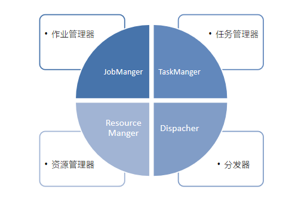

---
title: flink运行架构-运行时组件
date: 2023-07-16 22:57:51
categories:
- 大数据
- flink
tags:
- flink运行时组件
---

# flink 运行时组件

## 作业管理器（JobManager）
+ 控制一个应用程序执行的主进程，每一个应用程序都会被一个不同的JobManager所控制执行
+ JobManager 会先接收到要执行的应用程序，这个应用程序会包括：作业图（JobGraph）、逻辑数据流图（Logical dataflow graph）和打包了所有的类、库和其他资源的JAR包。
+ JobManager 会把JobGraph转换成一个物理层面的数据流图，这个图被叫做"执行图"（ExecutionGraph）,包含了所有可以并发执行的任务。
+ JobManager 会向资源管理器（ResourceManager）请求任务必要的资源，也就是任务管理器（TaskManager）上的插槽（Slot）。一旦它获取到了足够的资源，就会将执行图分发到真正运行他们的TaskManager上。而在运行过程中，JobManager会负责所有需要中央协调的操作，比如检查点（checkpoint）的协调。

## 任务管理器（TaskManager）

+ flink的工作进程。通常在flink中会有多个TaskManager运行，每个TaskManager都包含了一定数量的插槽（slots）。插槽的数量限制了TaskManager能够执行的任务数量。
+ 启动之后，TaskManager会向资源管理区注册它的插槽；收到资源管理器的指令后，TaskManager就会将一个或多个插槽提供给JobManager调用。JobManager就可以向插槽分配任务（task）了。
+ 在执行过程中，一个TaskManager可以跟其他运行同一应用程序的TaskManager交换数据。

## 资源管理器（ResourceManager）

+ 主要负责管理任务管理器（TaskManager）的插槽（slot）,TaskManager插槽是flink中定义的处理资源单元。
+ flink为不同的环境和资源管理工具提供了不同的资源管理器，比如Yarn,Mesos,K8s以及standalone部署。
+ 当JobManager申请插槽资源时，ResouceManager会将有空闲插槽的TaskManager分配给JobManager。如果ResourceManager没有足够的插槽来满足JobManager的请求，它还可以向资源平台发起会话，以提供启动TaskManager进程的容器。

## 分发器（Dispatcher）
+ 可以跨作业运行，它为应用提交提供了REST接口。
+ 当一个应用被提交执行时，分发器就会启动并将应用移交给一个JobManager。
+ Dispatcher也会启动一个Web UI，用来方便地展示和监控作业执行的信息。
+ Dispatcher在架构中可能并不是必需的，这取决于应用提交运行的方式。