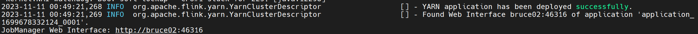
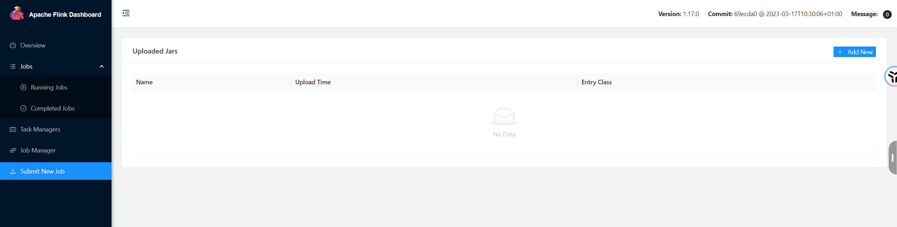

# flink 部署模式

## 一 概述

在一些应用场景中，对于集群资源分配和占用的方式，有特定的需求。Flink为各种场景提供了不同的部署模式，主要有以下三种：

会话模式（Session Mode）、

单作业模式（Per-Job Mode）、

应用模式（Application Mode）。

主要区别在于：集群的生命周期和资源的分配方式；以及应用的main方法到底在哪里执行---客户端（Client）还是JobManager。

### 1.1 会话模式

会话模式需要先启动一个集群，保持一个会话，在这个会话中通过客户端提交作业。集群启动时所有的资源就已经确定，所有提交的作业都会竞争集群中的资源。


会话模式单个规模小，执行时间短的大量作业。

### 1.2 单作业模式

会话模式因为资源共享会导致很多问题，我们可以考虑为每个提交的作业启动一个集群，这就是单作业模式（Per-Job Mode）。


作业完成后，集群就会关闭，所有资源也会释放。

这些特性使得单作业模式在生产环境更加稳定，是生产环境的首选模式。

Flink本身无法这样运行，所以单作业模式一般需要借助一些资源管理框架来启动集群，比如YARN,Kubernetes(K8s).

### 1.3 应用模式

前面的两种方式，应用代码都是在客户端执行，然后由客户端提交给JobManager。但是这种方式客户端需要占用大量的网络带宽，去下载依赖和和二进制数据发送给JobManager;并且很多情况下提交作业是同一个客户端，会加重客户端所在节点的资源消耗。

应用模式提供了解决办法，即将应用提交到 JobManager 上运行，这代表着，我们需要为每一个提交的应用单独启动一个 JobManager ,也就是创建一个集群。这个 JobManager 只为执行这个应用而存在，执行结束后 JobManager 也就关闭了


应用模式与单作业模式，都是提交作业之后才创建集群；单作业模式是通过客户端来提交的，客户端解析出的每一个作业对应一个集群；而应用模式下，是直接有JobManger执行应用程序的。

## 二 部署模式的具体应用

实际应用时，一般需要和资源管理平台结合起来，选择特定的模式来分配资源和部署应用。

### 2.1 Standalone运行模式

独立模式是独立运行的，不依赖任何外部的资源管理平台；当然独立也是有代价的：如果资源不足，或者出现故障，没有自动扩展或重分配资源的保证，必须手动处理。所以独立模式一般只用在开发测试或作业非常少的场景下。

#### 2.1.1 会话模式部署

提前启动集群，并通过Web页面客户端提交任务（可以多个任务，但是集群资源固定）。

#### 2.1.2 单作业模式部署

Flink的Standalone集群并不支持单作业模式部署。因为单作业模式需要借助一些资源管理平台。

#### 2.1.3 应用模式部署

应用模式下不会提前创建集群，所以不能调用start-cluster.sh脚本。我们可以使用同样在bin目录下的standalone-job.sh来创建一个JobManager。


步骤如下：

1）进入Flink的安装路径下，将应用程序的jar包放到lib/目录下

2）执行命令，启动JobManager

```
bin/standalone-job.sh start --job-classname jar包全路径
```

3）使用bin目录下的脚本，启动TaskManager

```
bin/taskmanager.sh start
```

4）查看任务执行状态

5）停掉集群，命令如下：

```
bin/taskmanager.sh stop
bin/standalone-job.sh stop
```

### 2.2 YARN运行模式

YARN上部署的过程是：客户端把Flink应用提交给Yarn的ResourceManager,Yarn的ResourceManager会向Yarn的NodeManager申请容器。在这些容器上，Flink会部署JobManager和TaskManager的实例，从而启动集群。Flink会根据运行在JobManager上的作业所需要的Slot数量动态分配TaskManager资源。

在将Flink任务部署至YARN集群之前，需要确认集群是否安装有Hadoop，保证Hadoop版本至少在2.2以上，并且集群中安装有HDFS服务。

具体配置步骤如下：

1）配置环境变量，增加环境变量配置如下：

```shell
sudo vim /etc/profile.d/my_env.sh

HADOOP_HOME=/opt/module/hadoop-2.9.2
export PATH=$PATH:$HADOOP_HOME/bin:$HADOOP_HOME/sbin
export HADOOP_CONF_DIR=${HADOOP_HOME}/etc/hadoop
export HADOOP_CLASSPATH=`hadoop classpath`
```

2）启动Hadoop集群，包括HDFS和YARN。

```shell
start-dfs.sh
start-yarn.sh
```

#### 2.2.1 会话模式部署

YARN的会话模式与独立集群略有不同，需要首先申请一个YARN会话（YARN Session）来启动Flink集群。具体步骤如下：

1）启动集群

（1）启动Hadoop集群（HDFS、YARN）。

（2）执行脚本命令向YARN集群申请资源，开启一个YARN会话，启动Flink集群。

```shell
bin/yarn-session.sh -nm test -d
```

可用参数解读：

可用参数解读：

+ -d：分离模式，如果你不想让Flink YARN客户端一直前台运行，可以使用这个参数，即使关掉当前对话窗口，YARN session也可以后台运行。

+ -jm（--jobManagerMemory）：配置JobManager所需内存，默认单位MB。

+ -nm（--name）：配置在YARN UI界面上显示的任务名。

+ -qu（--queue）：指定YARN队列名。

+ -tm（--taskManager）：配置每个TaskManager所使用内存。

注意：Flink1.11.0版本不再使用-n参数和-s参数分别指定TaskManager数量和slot数量，YARN会按照需求动态分配TaskManager和slot。所以从这个意义上讲，YARN的会话模式也不会把集群资源固定，同样是动态分配的。

YARN Session启动之后会给出一个Web UI地址以及一个YARN application ID，如下所示，用户可以通过Web UI或者命令行两种方式提交作业。



2）提交作业

（1）通过Web UI提交作业

​          这种方式比较简单，与上文所述Standalone部署模式基本相同。



（2）通过命令行提交作业

① 将FlinkTutorial-1.0-SNAPSHOT.jar任务上传至集群。

② 执行以下命令将该任务提交到已经开启的Yarn-Session中运行。

```shell
bin/flink run -c com.bruce.wc.SocketStreamWordCount FlinkTutorial-1.0-SNAPSHOT.jar
```

客户端可以自行确定JobManager的地址，也可以通过-m或者-jobmanager参数指定JobManager的地址，JobManager的地址在YARN Session的启动页面中可以找到。

③ 任务提交成功后，可在YARN的Web UI界面查看运行情况。bruce02:8088。

#### 2.2.2 单作业模式部署

在YARN环境中，由于有了外部平台做资源调度，所以我们也可以直接向YARN提交一个单独的作业，从而启动一个Flink集群。

1）执行命令提交作业

```shell
bin/flink run -d -t yarn-per-job -c com.bruce.wc.SocketStreamWordCount FlinkTutorial-1.0-SNAPSHOT.jar
```

注意：如果启动过程中报如下异常。

```shell
Exception in thread “Thread-5” java.lang.IllegalStateException: Trying to access closed classloader. Please check if you store classloaders directly or indirectly in static fields. If the stacktrace suggests that the leak occurs in a third party library and cannot be fixed immediately, you can disable this check with the configuration ‘classloader.check-leaked-classloader’.
at org.apache.flink.runtime.execution.librarycache.FlinkUserCodeClassLoaders
```

解决办法：在flink的/opt/module/flink-1.17.0/conf/flink-conf.yaml配置文件中设置

```shell
vim flink-conf.yaml

classloader.check-leaked-classloader: false
```

2）在YARN的ResourceManager界面查看执行情况。

3）可以使用命令行查看或取消作业，命令如下

```shell
bin/flink list -t yarn-per-job -Dyarn.application.id=application_XXXX_YY
bin/flink cancel -t yarn-per-job -Dyarn.application.id=application_XXXX_YY <jobId>
```

这里的application_XXXX_YY是当前应用的ID，<jobId>是作业的ID。注意如果取消作业，整个Flink集群也会停掉。

#### 2.2.3 应用模式部署

应用模式同样非常简单，与单作业模式类似，直接执行flink run-application命令即可。

1）命令行提交

（1）执行命令提交作业。

```shell
bin/flink run-application -t yarn-application -c com.bruce.wc.SocketStreamWordCount FlinkTutorial-1.0-SNAPSHOT.jar 
```

（2）在命令行中查看或取消作业。

[atguigu@hadoop102 flink-1.17.0]$ 

``` shell
bin/flink list -t yarn-application -Dyarn.application.id=application_XXXX_YY
bin/flink cancel -t yarn-application -Dyarn.application.id=application_XXXX_YY <jobId>
```

2）上传HDFS提交

可以通过yarn.provided.lib.dirs配置选项指定位置，将flink的依赖上传到远程。

（1）上传flink的lib和plugins到HDFS上

```shell
[root@bruce01 flink-1.17.0]$ hadoop fs -mkdir /flink-dist

[root@bruce01 flink-1.17.0]$ hadoop fs -put lib/ /flink-dist

[root@bruce01 flink-1.17.0]$ hadoop fs -put plugins/ /flink-dist]
```

（2）上传自己的jar包到HDFS

```shell
[root@bruce01 flink-1.17.0]$ hadoop fs -mkdir /flink-jars

[root@bruce01 flink-1.17.0]$ hadoop fs -put FlinkTutorial-1.0-SNAPSHOT.jar /flink-jars
```

（3）提交作业

```shell
[root@bruce01 flink-1.17.0]$ bin/flink run-application -t yarn-application	-Dyarn.provided.lib.dirs="hdfs://hadoop102:8020/flink-dist"	-c com.bruce.wc.SocketStreamWordCount  hdfs://hadoop102:8020/flink-jars/FlinkTutorial-1.0-SNAPSHOT.jar
```

这种方式下，flink本身的依赖和用户jar可以预先上传到HDFS，而不需要单独发送到集群，这就使得作业提交更加轻量了。

## 三 历史服务器

Flink提供了历史服务器，用来在相应的 Flink 集群关闭后查询已完成作业的统计信息。我们都知道只有当作业处于运行中的状态，才能够查看到相关的WebUI统计信息。通过 History Server 我们才能查询这些已完成作业的统计信息，无论是正常退出还是异常退出。

此外，它对外提供了 REST API，它接受 HTTP 请求并使用 JSON 数据进行响应。Flink 任务停止后，JobManager 会将已经完成任务的统计信息进行存档，History Server 进程则在任务停止后可以对任务统计信息进行查询。比如：最后一次的 Checkpoint、任务运行时的相关配置。

1）创建存储目录

hadoop fs -mkdir -p /logs/flink-job

2）在flink-config.yaml中添加如下配置

```sh
jobmanager.archive.fs.dir: hdfs://bruce01:8020/logs/flink-job

historyserver.web.address: bruce01

historyserver.web.port: 8082

historyserver.archive.fs.dir: hdfs://bruce01:8020/logs/flink-job

historyserver.archive.fs.refresh-interval: 5000
```

3）启动历史服务器

```shell
bin/historyserver.sh start
```

4）停止历史服务器

```shell
bin/historyserver.sh start
```

5）在浏览器地址栏输入：http://bruce01:8082 查看已经停止的job的统计信息
