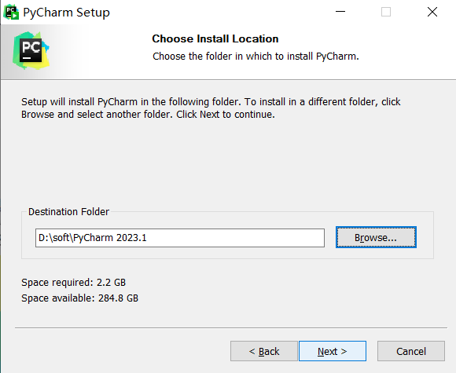
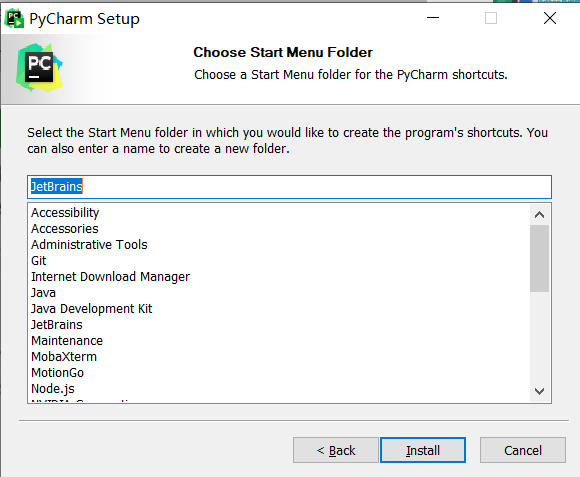
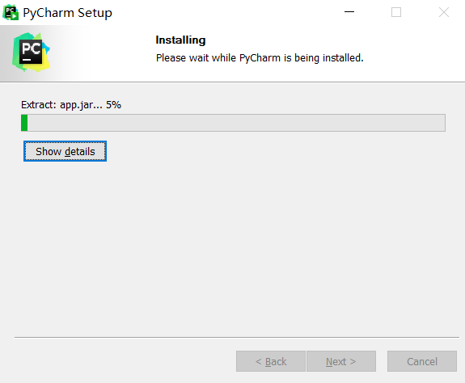
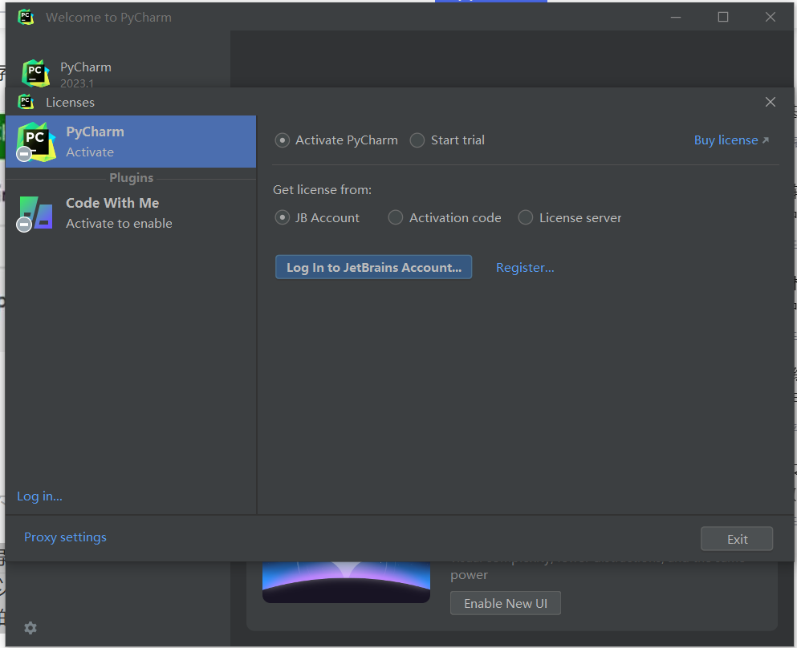
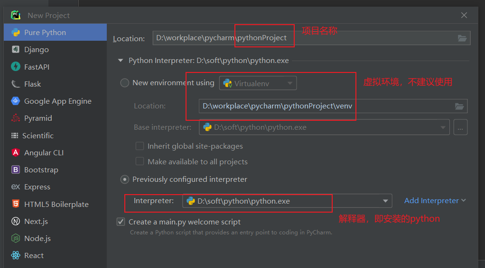

# pyCharm下载与安装

## 一 pyCharm下载

### 1.下载

各种版本的下载地址：https://www.jetbrains.com/pycharm/download/other.html

我这边下载的是专业版，也可以下载社区版，免费

### 2.安装包

## 二 pyCharm安装

### 1. 运行PyCharm Setup

### 2.指定安装位置

### 3.安装选项设置

### 4.开始菜单中PyCharm快捷方式的文件夹设置

默认JetBrains文件夹，电脑开始菜单中JetBrains文件夹会生成PyCharm快捷方式。这里可采用默认JetBrains文件夹，点击Install进行安装，进入PyCharm安装进度界面。

### 5.安装完成

安装进度完成后，出现 PyCharm安装完成需要重启电脑的提示界面。可以选择立即重启电脑，也可以稍后手动重启电脑，这里选择立即重启电脑，重启电脑后，双击启动PyCharm时，会出现导入PyCharm设置的提示。

### 6. 导入PyCharm配置文件

Previous version： 默认导入以前PyCharm设置文件，会自动显示以前的PyCharm设置文件的路径。

Config or installation directory：手动导入PyCharm配置或安装设置。

Do not import settings：不导入设置。

如果未检测到电脑存在过去安装PyCharm的设置文件，会出现导入PyCharm设置界面。

上面界面主要用来导入已有的PyCharm设置，若没有PyCharm设置或不导入已有的PyCharm设置，可以选择不导入。选择Do not import settings(不导入设置)，点击OK，出现下图所示的PyCharm和插件(Plugins)激活界面。

### 7.专业版激活

Activate PyCharm：激活PyCharm，有三种激活方式， JB Account是用JB账号的方式激活， Activation code是激活码方式激活，License server是许可证服务器授权方式激活。

若选择JB Account激活，需要登录JB账号获取许可，若选择Activation code激活，需要输入激活码，若选择License server激活，需要输入服务器地址。

Start trial：选择试用PyCharm，可以通过注册的账号免费试用30天。

选择PyCharm的Activation code激活，输入激活码后，单击Activate按钮进行激活

### 8.新建项目

