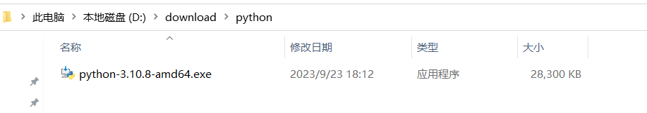
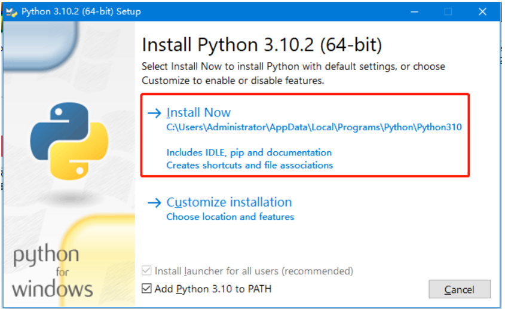
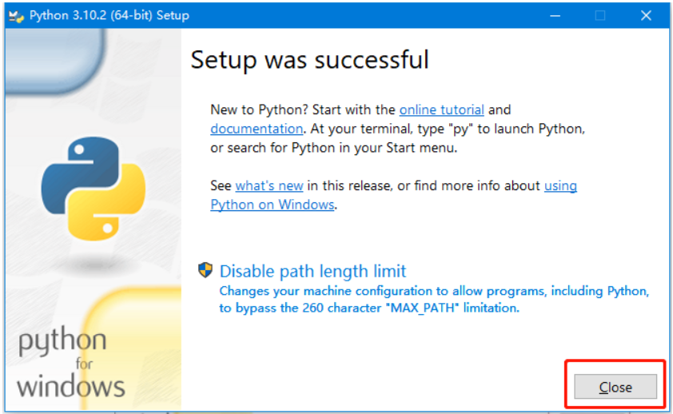
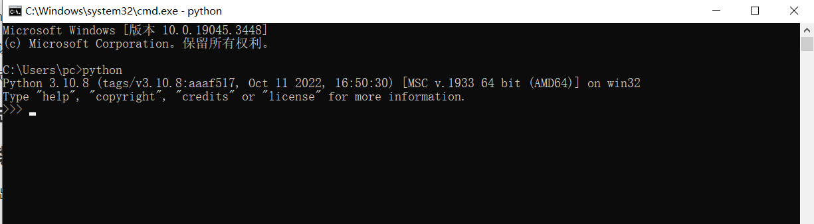

# Python下载与安装-windows

## 一 python下载

### 1.下载python

官网地址：https://www.python.org/

下载地址：https://www.python.org/downloads/windows/

### 2.安装包

## 二 python 安装

### 1.双击安装

请勾选 add Python 3.10 to PATH,即将python命令工具所在目录添加到系统Path环境变量中，以后开发程序或者运行python会很方便

Python支持两种安装方式，默认安装和自定义安装：

+ 默认安装会勾选所有组件，并安装在C盘
+ 自定义安装可以选择要安装的组件，自定义安装到其他盘

### 2.点击install now安装

### 3.安装成功

当界面出现“Setup was successful”,单击close按钮完成安装

### 4.验证

Window+R，输入cmd进入DOS命令界面，输入python验证是否安装成功，弹出下列界面即安装成功。

