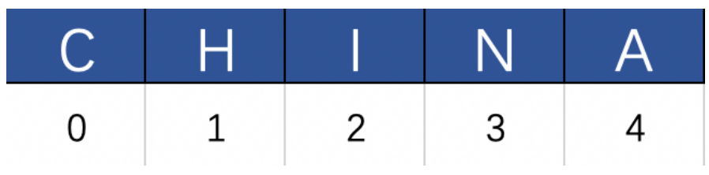
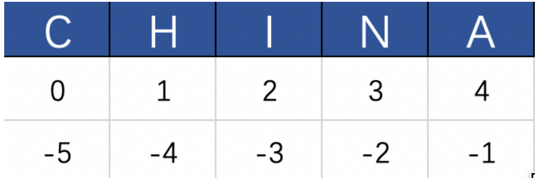
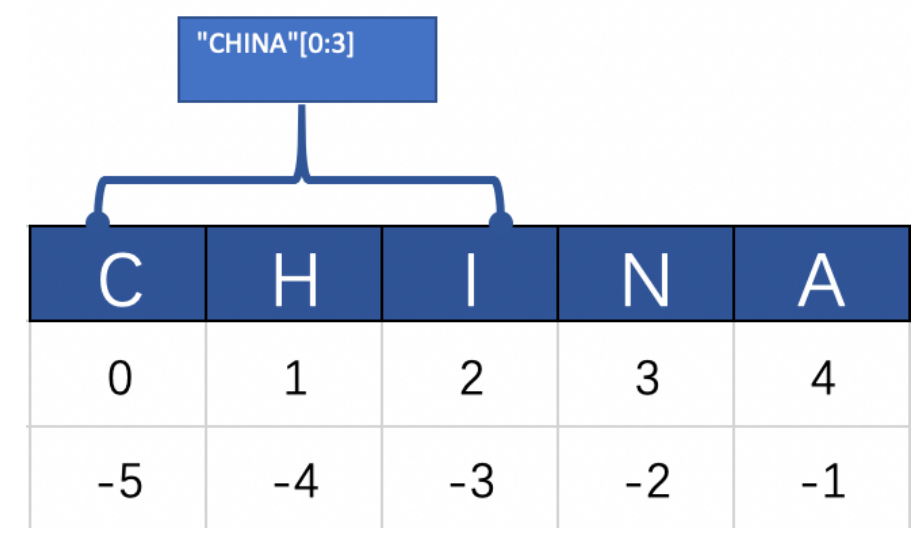

# Python数据结构

## 一 字符串

### 1.1 字符串的格式化输出

#### 1.1.1 格式化运算符

```python
print("我跑完了第%d圈" % 1)
```

%d是一种占位，表示要显示在这里是一个整数，常用的占位符有以下几种：

| 占位符 | 描述                   |
| ------ | ---------------------- |
| %d     | 整数占位符             |
| %f     | 浮点数占位符           |
| %.f    | 指定精度的浮点数占位符 |
| %s     | 字符串占位符           |
| %%     | 输出百分号%            |

如果给%d一个浮点数，他会自动输出一个整数（向下取整）

```python
print("%d" % 3.14)  #输出3
print("%d" % 3.99)  #输出3
```

转换成整数的规则和类型转换的规则一 样，不会四舍五入。

%f的使用

```python
print("%f" % 3.14)
```

输出“3.140000”,后面的0是自动补齐的，如果只想要输出小数点后两位，可以这样写：
```python
print("%.2f" % 3.14)
print("%.2f" % 3.1415926)
```

输出都是“3.14”，“%.2f”指定了小数点后面的位数，即使浮点数后面的小数部分超出了2位数，它也只会输出两位，如果不足两位，或者是个整数，会自动补零到两位。

```python
print("%.2f" % 3.1) #3.10
print("%.2f" % 3)   #3.00
```

%s 是最广泛的占位符，它可以对应任何类型的变量。

```python
print("%s" % 3.14) # 输出3.14
print("%s" % 3)    # 输出3
print("%s" % "python")    # 输出python
```

合起来使用

```python
report = "%d年%s公司营收增长了百分之%.2f" % (2023, "腾讯", 20.2898)
print(report)
```

当我们需要在字符串输出一个百分比，就需要用到%%，比如说：

```python
report = "%d年%s公司营收增长了%.2f%%" % (2019, "腾讯", 20.28)
print(report)
```

#### 1.1.2  format函数

除了%运算符外，Python还为我们提供了字符串的format函数提供丰富的格式化。比如说，在输出一个较长的数字时，根据国际惯例，每三位用逗号分隔：

```python
print('{:,}'.format(12345678900))
输出：12,345,678,900
```

format函数也可以像%那样来格式化多个参数：

```python
report = "{0}年{1}公司营收增长了{2}%".format(2023,"腾讯"，20.88)
print(report)
```

{0}表示第一个参数，{1}{2}表示第二、第三个参数，以此类推。这样做的好处是，如果有参数在字符串出现多次，可以不用重复的传入。

```python
'{0}的GDP为{1:,}...虽然它的GDP只有{1:,}美元，但它的人均GDP高达18万美元'.format("摩纳哥",7100000000)
```

### 1.2 字符串的下标和切片

字符串也是一种序列，即一串整齐的按着顺序排列的字符，组成了字符串，每个字符在队伍中都有自己的位置，这个位置就是下标，又叫做索引



如图，"CHINA"这个字符串，从左往右每一个字符对应了一个下标（索引），需要特别注意的是，在计算机编程中，**所有的下标都是从0开始的**，当我们要访问一个字符串的第1个字符时，使用的下标应该是0。

使用中括号加数字的方式，表示要访问的是具体哪个位置上的字符。

```python
"CHINA"[0]  # 第1个字符"C"
"CHINA"[1]  # 第2个字符"H"
"CHINA"[4]  # 第5个字符"A"
```

第5个字符"A"是这个字符串的最后一个，我们也可以这样来访问：

```python
"CHINA"[-1]  # 最后一个字符"A"
"CHINA"[-2]  # 倒数第二个字符"N"
```

使用负数下标可以从右往左访问，对于任意长度的字符串，我们都可以使用-1来获取它的最后一个字符，注意使用负数下标是从-1开始的。



切片操作



```python
"CHINA"[0:3]
```

输出是“CHI”,切片操作是以: 隔开两个下标，特别需要注意的是，结尾下标表示截取到该下标前一个位置的下标，左开右闭。那[0:3]，一共截取了3-0=3个字符，从0开始数，0、1、2，恰好是三个。

如果用[0:0],将会得到一个空字符串

```python
"CHINA"[0:0]  #空字符串
"CHINA"[0:-1] #CHIN
```

如果想得到整个字符串，可以这样写：

```python
"CHINA"[0:6]  #CHINA
```

一般会冒号右边的省略，表示一直截取到最后一个字符

```python
"CHINA"[0:]  #CHINA
```

事实上，前面的0也可以不写，冒号左边为空表示从第一个字符开始截取

```python
#从0到末尾
"CHINA"[:] #CHINA
#从0到第3个
"CHINA"[:3]  #CHI
#从第三个到末尾
"CHINA"[2:] #INA

```

如果想要隔一个字符取一个

```python
#每隔两个字符取一个
"CHINA"[::2]  #CIA
```

第二个冒号表示截取步长，2表示每两个字符去一个，如果不传，默认每个都取。步长也可以为负数，如果传递一个负数，表示从右往左进行截取

```python
#从右往左每隔两个字符截取一个
"CHINA"[::-2]  #AIC
```

如果想要倒序输出

```python
"CHINA"[::-1] #ANIHC
```

### 1.3 字符串函数

#### 1.3.1 去除空白字符的函数

空白符包括空格、换行（\n）、制表符（\t）。

strip函数的作用就是去除字符串首尾的所有空白字符。

```python
" abc ".strip()
"\t abc \n".strip()
```

得到的将是字符串"abc"，但是strip函数并不会去除掉字符串之间的空白字符

```python
" a b c ".strip()
```

得到的结果是"a b c"，只去掉了首尾空白字符，保留了中间的。

另外还有 lstrip 和 rstrip 函数，分别去除字符串左边和右边的空白字符

```python
" abc ".lstrip() # 结果'abc '
" abc ".rstrip() # 结果' abc'
```

#### 1.3.2 大小写操作

```python
# 将所有字符变成大写
"china".upper() # CHINA
# 将字符串的首字母变成大写
"china".capitalize() # China
# 将所有字符变成小写
"CHINA".lower() # china
# 将每个单词的首字母变成大写
"i have a dream".title() # I Have A Dream
```

#### 1.3.3 字符串判断

```python
startswith     是否以指定的字符串开头

endswith       是否以指定的字符串结尾

isdigit        是否是一串数字

islower        是否全是小写字母

isupper        是否全是大写字母
```

#### 1.3.4 查找与替换

我们可以使用 in 来判断一个字符串是否在另一个字符串中

```python
password = '123'
input_pwd = '456123789001'
print(password in input_pwd)   # True
```

以上可以判断出input_pwd中是否有password,但如果想要知道password在input_pwd中的具体位置，就需要使用find函数

```python
input_pwd.find(password)  #结果是3
```

出现的位置是3,即第四个字符，如果没有找到则返回-1

```python
input_pwd.find("exist")  #结果是-1
```

除了find函数，index函数也有相同的功能，唯一的区别是，index函数如果没有找到相应的字符串就会报错

```python
input_pwd.index(password) # 结果是3
# 这行代码将会在运行时报错
input_pwd.index("notexists")
```

count函数能够查找出指定的字符串一共出现了几次，如果没有出现，则返回0。

```python
"abba".count('a') # 2
'abba'.count('c') # 0
```

replace函数提供了替换字符串中某些部分的功能

```python
"abba".replace('a', 'b') # 结果是'bbbb'
'apple banana'.replace('apple', 'orange')
# 结果是'orange banana'
```

#### 1.3.5 字符串长度

字符串本身没有测量长度的函数，需要借助一个Python内置函数len。

```python
len("China") # 5
len("") # 0
len("a") # 1
```

len函数非常重要，它不光可以测量字符串的长度，也可以测量其他所有有长度的对象。

## 二 元组

### 2.1 定义元组

元组，英文叫tuple，可这样来定义一个元组：

```python
t = ('my','age', 'is',18)
```

元组中的每一项称作元素，4个元素按照从左到右的顺序排列。可以用下标索引访问：

```python
t[0] # 'my'
t[-1] # 18
```

也可以通过切片来访问，注意切片返回的是一个包含切片片段的新元组。

```python
t[0:2] # ('My', 'age')
```

事实上元组定义的时候也可以不用括号

```python
t = 'My', 'age', 'is', 18
```

元组中只有一个元素的时候，必须要加一个逗号：

```python
t = ('solo',）
# 或者不带括号
t = 'solo',
```

可以将一个序列强制转换为元组

```python
tuple('abc') # ('a', 'b', 'c')

tuple(range(5)) # (0, 1, 2, 3, 4)
```


### 2.2 元组操作

join函数，可以吧元组这样的序列拼接成一个整体的字符串

```python
#注意最后一个元素
t = ('My','age','is','18')
print(" ".join(t))
#输出：'My age is 18'
```

注意最后一个元素，18是一个字符串，因为join函数要求参数序列中的每一个元素都必须是字符串

和字符串一样，元组也有count和index函数，使用方法也是一样

```python
t = ('a', 'b', 'b', 'a')
t.count('a') # 2
t.index('b') # 1
t.index('c') # Error
# 查看长度
len(t) # 4
```

元组也支持 in 操作，想要判断元组中是否包含某个元素：

```python
'a' in t # True
'x' in t # False
```

元组和字符串都是只读的，也就是不可修改的。我们不能单独改变元组中的某个元素，或者是字符串中的某个字符。

### 2.3 遍历元组

元组属于序列，所以可以像字符串那样去遍历它：

```python
tle = ('a','b','c','d','e')
for i in tle:
   print(i)
```

例子：

```python
# 当元组元素较多、较长时，可以这样书写
sales = (
("Peter", (78, 70, 65)),
("John", (88, 80, 85)),
("Tony", (90, 99, 95)),
("Henry", (80, 70, 55)),
("Mike", (95, 90, 95)),
)
```

需求：找出总销售额最高的那个员工，并将TA的名字和总销售额输出。

```python
champion = ''
max_amount = 0
for sale in sales:
	name = sale[0]
	quarter_amount = sale[1]
	total_amount = 0
	for month_amount in quarter_amount:
		total_amount += month_amount
	if total_amount > max_amount:
		max_amount = total_amount
		champion = name
print("第一季度的销冠是%s, TA的总销售额是%d万元" % (champion, max_amount))
```

上面的代码也可进一步优化一下，使得代码行数更少，结构更简单。

```python
champion = ''
max_amount = 0
for name, quarter_amount in sales:
	total_amount = sum(quarter_amount)
	if total_amount > max_amount:
		champion, max_amount = name, total_amount
print("第一季度的销冠是%s, TA的总销售额是%d万元" % (champion, max_amount))
```

## 三 列表list

### 3.1 定义列表

列表可以理解为可变的元组，使用方式和元组差不多，区别就是列表可以动态的增加，修改，删除元素

列表的定义

```python
# 定义一个空列表
lst = []
lst = list()
# 定义带有初始值的列表
lst = [1,2,3]
lst = ["a",1,2,3,"b","c"]
lst = list(range(5))
lst = list("abc")
lst = list((1,2,3))
```

### 3.2 增删改查

列表的访问和字符串、元组一样，索引或者下标都可以。

```python
lst = ['a', 'b', 'c', 'd', 'e']
lst[0] # 'a'
lst[1:3] # ['b', 'c']
```

列表是可以修改的, 还是以上面的lst为例：

```python
lst.apppend('x')
```

往lst里添加了一个元素，现在列表变成了

```python
['a', 'b', 'c', 'd', 'e', 'x']
```

注意append函数总是在列表后面添加元素，列表的长度也增加了1.因此原来list[-1]的值从原来的'e'变成了'x'

```python
len(lst) # 6
lst[-1] # 'x'
```

修改列表中的元素

```python
lst[-1] = 'f'
# 修改后列表变为：
# ['a', 'b', 'c', 'd', 'e', 'f']
```

删除列表中的元素

```python
del lst[0]
# 删除后列表变为：
['b', 'c', 'd', 'e', 'f']
```

注意，由于我们删除的是第一个元素，现在剩下的所有元素的索引都发生了变化，第一个lst[0]变成了'b'，后面的也都往前挪了一位。但是lst[-1]没有变，还是'f'。涉及到删除操作的时候要小心，防止使用错误的索引。

### 3.3 列表函数

列表也是一种序列，它也具有index和count函数和支持len函数，这些函数的用法和元组一样，它的循环遍历也和元组一样，下面是列表特有的一些函数

**insert**

insert函数可以向任意位置添加元素，而append函数只能在最后添加元素

```python
lst = ['a', 'c', 'e']
# 在第二个元素'c'前面插入一个字符串'b'
lst.insert(1, 'b')
# lst现在的值是['a', 'b', 'c', 'e']
# 在最后一个元素'e'前面插入一个字符串'd'
lst.insert(-1, 'd')
# lst现在的值是['a', 'b', 'c', 'd', 'e']
```

**pop**

每次调用pop函数会从列表中“弹”出一个元素

```python
temp = lst.pop()
print(lst) # ['a', 'b', 'c', 'd']
print(temp) # 'e'
```

如果想“弹”出其他位置的元素，可以传一个位置参数给pop函数，像这样：

```python
temp = lst.pop(2)
print(lst) # ['a', 'b', 'd']
print(temp) # 'c'
```

**remove**

del操作可删除指定下标索引的元素，如果我们要删除指定内容的元素，就需要用到remove函数。

```python
lst = [1, 2, 1, 'a', 'b', 'c']
lst.remove('a')
print(lst) # lst的值为[1, 2, 1, 'b', 'c']
lst.remove(1) # 注意这里的1是元素值，不是索引
print(lst) # lst的值为[2, 1, 'b', 'c']
```

remove函数会从左至右找到与指定的值相匹配的第一个元素，并将它删除。在使用的时候需要区分del,pop, remove的区别。

**clear**

clear函数会清空列表内的所有元素。

```python
lst = [1,2,3,4]
lst.clear()
print(lst) # 结果为[]
```

**extend**

extend函数有点像append函数，但append函数每次只能添加一个元素，而extend可以添加一组。

```python
lst = []
lst.extend(range(5))
print(lst) # [0, 1, 2, 3, 4]
lst.extend([5, 6, 7])
print(lst) # [0, 1, 2, 3, 4, 5, 6, 7]
```

**reverse**

将整个列表反转，以上一步的lst为例

```python
lst.reverse()
print(lst) # [7, 6, 5, 4, 3, 2, 1, 0]
```

**sort**

按照一定的规则将列表中的元素重新排序，对于数值，默认按从小到大的顺序排列。

```python
lst = [3, 5, 2, 1, 4]
lst.sort()
print(lst) # [1, 2, 3, 4, 5]
```

如果想要让列表从大到小排列，可以加上reverse参数。

```python
lst = [3, 5, 2, 1, 4]
lst.sort(reverse=True)
print(lst) # [5, 4, 3, 2, 1]
```

对于字符串，则会按照它们的ASCII值的顺序排列。ASCII是基于拉丁字母的一套电脑编码系统，所有的编程语言都支持ASCII编码。ASCII值一共有128个字符，包含数字0~9，字母a-z, A-Z，还有一些常用的符号。每一个字符对应一个数字，比如字母'A'对应的就是65， 字母'B'对应66，等等。在Python中，可以使用内置函数将字符与它的ASSCII值互转。

```python
ord('A') # 65
chr(66) # 'B'
```

sort函数会比对每个字符串的第一个字符，如果第一个字符相同，则比对第二个字符，以此类推。

```python
fruits = ['apple', 'banana', 'orange', 'blueberry']
fruits.sort()
print(fruits) # ['apple', 'banana', 'blueberry', 'orange']
```

有下面一个列表，它存储了公司第一季度每个月的收入。

```python
revenue = [('1月', 5610000), ('2月', 4850000), ('3月', 6220000)]
```

注意列表中的每一个元素是一个元组，元组的第一项是月份，第二项是销售额，现在想要按照它的销售额来从高到低排序。如果直接调用sort函数，它会按照元组中第一项的字符串顺序进行排序。

```python
revenue.sort(reverse=True)
# 排序后为 [('3月', 6220000), ('2月', 4850000), ('1月', 5610000)]
```

这显然不对，2月的收入比1月低，应该排到最后。这时应该传递key参数

```python
revenue.sort(reverse=True, key=lambda x:x[1])
# 排序后为 [('3月', 6220000), ('1月', 5610000), ('2月', 4850000)]
```

key参数接收的是一个函数，我们在这里给它传递了一个匿名函数，通过key参数，我们指定了sort排序的依据，就是每个元组里面的第二项。

**copy**

```python
lst1 = [1, 2, 3]
lst2 = lst1
lst1.append(4)
```

上面的代码执行完成以后，lst 和 lst2的值都变成了 [1, 2, 3, 4] ，但我们在代码里面只修改了lst1,lst2的值也跟着改变了，这不符合我的预期，可能会导致bug。所以，如果我们想要创建一个跟lst1一模一样的新列表，且不再受它以后操作的影响，就可以使用copy函数：

```python
lst1 = [1, 2, 3]
lst2 = lst1.copy()
lst1.append(4)
print(lst1) # [1, 2, 3, 4]
print(lst2) # [1, 2, 3]
```

### 3.4 列表表达式

列表表达式是一种快捷创建列表的表达式，可以将多行代码省略为一行。例如：列出20以内的所有偶数

```python
lst = list(i for i in range(20) if i % 2 == 0)
print(lst)
lst = list(i for i in range(0, 20, 2))
print(lst)
lst = list(i * 2 for i in range(10))
print(lst)

#输出
[0, 2, 4, 6, 8, 10, 12, 14, 16, 18]
[0, 2, 4, 6, 8, 10, 12, 14, 16, 18]
[0, 2, 4, 6, 8, 10, 12, 14, 16, 18]
```

range函数可以接收3个参数：第一个是起始数值（包含），可以省略，默认从0开始；第二个是结束数值（不包含）；第三个是步长，可以省略，默认为1

打印出大写的26个字母。

```python
# 65是大写字母‘A’的ASCII值
[chr(i) for i in range(65, 65 + 26)]
```

## 四 字典

### 4.1 字典的定义

使用花括号，可以直接定义字典

```python
sales = {
'Peter': 213,
'John': 253,
'Tony': 284,
'Henry': 205,
'Mike': 280
}
```

每一行冒号左边的是键（key）,右边的是值（value），称作键值对，以逗号分隔开。键是不能重复的，值可以重复。即Java中的map

对于top_sales 这种两个一组、一一对应的列表来说，可以直接转换为字典。

```python
sales = dict(top_sales)
# sales现在的值变成了
{
'Peter': 213,
'John': 253,
'Tony': 284,
'Henry': 205,
'Mike': 280
}
```

### 4.2 增删改查

取出任何一人的数据

```python
sales['Mike']
sales['Henry']
```

注意：key的名称是区分大小写的，‘Mike’和‘mike’是对应不同的键

```python
sales['mike']
#KeyError:'mike'
```

这会报错，因为不存在‘mike’这个键，在访问之前可以先在字典中添加数据相应的键

```python
sales['mike'] = 0
```

修改字典中的数据：

```python
sales['mike'] = 200
```

删除字典中的数据

```python
del sales['mike']
```

### 4.3 遍历字典

```python
for key_value in sales.items():
	print(key_value)
```

注意 sales.items() 这种写法，在遍历字典时，这是一种通用的写法。items函数将字典内的内容转换成了一种可迭代的序列，以供for循环遍历，遍历出来的每一项是一个元组，包含了键和值。所以通常我们直接写成这样：

```python
for key, value in sales.items():
	print(key, value)
```

如果不使用items函数，那遍历的就是字典所有的key。

### 4.4 字典函数

**get**

如果直接访问字典中一个不存在的key，就会产生报错，所以，通常我们如果不确定是否存在某个key时，会先判断一下：

```python
if 'mike' in sales:
	print(sales['mike'])
else:
	print('mike', 0)
```

这样的写法，很麻烦，每次都要先判断，再查询，这时候get函数就派上用场了。

```python
sales.get('mike', 0)
```

**keys/values**

## 五 集合set

集合在Python中是一个无序不重复的序列，一般用来删除重复数据，还可以用来计算交集，并集等。

### 5.1 集合的定义

```python
nums = {1, 2, 3, 4, 5}
nums = set([1, 2, 3, 4, 5])
```

集合最常用的用法是用来消除列表或元组中的重复元素

```python
lst = [1, 2, 1, 3, 4, 5]
list(set(lst))
```

### 5.2 遍历集合

集合的遍历和列表、元组很相像。

```python
for n in nums:
	print(n)
```

### 5.3 增删改查

往集合中添加一个元素

```python
nums.add(5)  #什么也没做
nums.add(6) 
```

如果集合中已经有这个元素了，则什么也不做，

已经加入集合的元素不能修改，只能删除，删除集合中的元素

```python
nums.remove(5)
nums.remove(5) #Error
```

remove函数会从集合中删除指定元素，但如果元素不存在，则会报错，如果不想报错，可以使用discard函数

```python
#即使5不存在，discard函数也不会报错
nums.discard(5)
```

从集合内删除并返回一个元素

```
num = nums.pop()
```

如果集合是空的，会报错


### 5.4 集合函数

```python
# 定义两个集合
s1 = {1, 2, 3}
s2 = {3, 4, 5}
# 求交集
s1.intersection(s2) # {3}
# 求并集
s3 = s1.union(s2)
print(s3) # {1, 2, 3, 4, 5}
# 是否是子集
s1.issubset(s3) # True
# 是否是父集
s3.issuperset(s2) # True
```

