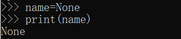

# python编程基础

## 一 变量

### 1.1 变量的定义

变量就是可变的量，对于一些有可能会经常变化的数据，我们需要使用一个符号，这样才能计算中使用它，就像我们学过的一元方程中的"x"一样

### 1.2 变量名规则

在Python中，变量名遵循以下的规则：

+ 变量名由字母、数字和下划线组成，也就是a-z, A-Z, 0-9和_
+ 变量名不能以数字开头
+ 变量名是区分大小写的，比如a 和 A就是两个不同的变量。


在此基础上，也约定了一些变量名的命名规范。比如：

+ 普通变量一般用小写字母

+ 最好不要用单词加数字的方式来命名变量，尤其是没有意义的随机数字。

+ 有两种风格的变量名：单词之间用下划线隔开；每个单词的首字母使用大写字母（也称为驼峰命名法）

### 1.3 关键字

以下的这些单词都是Python的关键字，每个编程语言都有各自的关键字，它们组成了编程语言基本的语法规则。在命名变量的时候避免使用这些名字。

```python
False await else import pass
None break except in raise
True class finally is return
and continue for lambda try
as def from nonlocal while
assert del global not with
async elif if or yield
```

如果你一不小心定义了一个与关键字相同的变量，代码会在运行的时候报错。比如：

```python
True = 0
# 上面这行代码运行会输出下面的信息，提示不能给关键字赋值。
# File "<stdin>", line 1
# SyntaxError: can't assign to keyword
```

### 1.4 变量赋值

变量是可以重复使用，并且是可以修改的，由于Python的变量不需要先声明，所以变量的声明和赋值是在同一行代码完成的

```python
name = "Bruce"
```

变量必须要先声明，才能使用。如果使用了一个从未定义过的变量xxx，Python解释器会抛给你一个这样的错误：

```python
NameError: name 'xxx' is not defined
```

有时候，我们需要定义好几个变量，以进行计算。比如定义三个变量，并把它们的值都设为1，可以这样写：

```python
a = b = c = 1
```

这样就定义三个变量，且它们的初始值都是1，那如果定义的三个变量值不同

```
a, b, c = 1, 2, 3
```

同时给多个变量赋予不同的值，还可以交换几个变量的值

```python
# 定义两个变量，其中a=1, b=2
a, b = 1, 2
# 进行交换，现在a=2, b=1
a, b = b, a
```

### 1.5 变量的销毁

在Python中，我们一般无需手动的去销毁变量，Python的垃圾回收机制会帮我们处理掉那些不再使用的变量，如果我们想刻意销毁删除某个变量，可以使用del关键字

```python
del name
```

## 二 数据类型

变量在Python中是不区分类型的，但它的值有类型，不同的值有不同的类型，三种基本的数据类型：

+ 数值，包括整数和浮点数

+ 字符串

+ 布尔值

### 2.1 数值

Python中数值有两种类型，整形(int)和浮点型(float)，通俗一点的讲，一个是不带小数点的，一个带小数点的。

```python
# 这是一个整形
a = 100
# 这是一个浮点型变量
b = 3.14
```

整形和浮点形数值可以相互运算

```python
# c是一个浮点型变量
c = a + b
```

只要有浮点数参与的运算，它的结果肯定也是浮点数

### 2.2 字符串

```python
a = "Hello world"
```

如果字符串含有特殊字符，比如双引号，可以加 反斜杠 \ 来进行转义

```python
print("Bruce: \"What we think, we become.\"")

\# 输出的结果是：Bruce: "What we think, we become."
```

如果使用单引号，就不需要使用反斜杠\

```python
print('Bruce: "What we think, we become."')
```

如果要定义的字符串比较长，超出了一行的长度，在编写的时候使用一个反斜杠 \ 来连接多行：

```python
sentence = "This's a very long long long \
long long sentence............"
print(sentence)
```

上面的代码在输出的时候还是会显示为一整行。如果说还有更长的字符串，类似一整段话，可以使用三引号

```python
zen = """Beautiful is better than ugly.
Explicit is better than implicit.
Simple is better than complex.
Complex is better than complicated.
Flat is better than nested.
Sparse is better than dense."""
print(zen)
```


也可以使用单个单引号。

### 2.3 布尔值

布尔值只有两个值: True 和 False，True代表真，False代表假，我们用布尔值一般是用来做条件判断。在Python3中，True和False是关键字，所以我们不能定义为变量名。

### 2.4 空值None

空值None是Python中的一个特殊值，它代表空值，表示“什么都没有”，None同时也是关键字。None的用处有很多，比如说你想定义一个变量，但还没想好给它赋什么值，甚至连它用什么类型也没决定好，可以先用None

```python
name=None
print(name)
```



None被输出的时候显示为一个字符串"None"

### 2.5 类型转化

#### 2.5.1 布尔值转换

想把其他值转换为布尔值，需要使用一个内置函数bool()

```python
# 以下值都为True
bool(1)
bool(-1)
bool(255)
bool(0.0000001)
bool(-99.99)
# 下面的值为False
bool(0)
bool(0.0)
```

**总结：对于数值类型，所有非0值转化为True,只有0值被转化为False**

字符串也可以转化为布尔值

```python
# 这是一个空字符串，转换结果为False
bool("")
# 转换结果为True
bool("abc")
# 这是一个只包含一个空格的字符串，转换结果为为True
bool(" ")
```

**总结：对于任何非空的字符串，转化为布尔值都是True,只有一个空格的字符串转化后为True**

```python
# 结果为False
bool(None)
```

**总结：空值转换为布尔值永远都是False**

#### 2.5.2 字符串转换

使用str() 将其他类型转换为字符串

True, False, None 这三个值转换为字符串就是它们的单词本身，实际上在实际编程中，我们很少需要把它们转换成字符串来使用。

```python
str(True) # 结果是'True'
str(False) # 结果是'False'
str(None) # 结果是'None'
```

对于数值类型，我们也可以用str()将它们转换为字符串

```python
print("My age is", str(18))
```

在这个例子中，如果不进行强制转换的话，也不会出错，那是因为，print函数会自动将数值先转换成字符串再输出。

#### 2.5.3 数值转换

要把一个整数字符串转换为int类型，使用int()；

```python
num = "1"
int(num) + 1
```

如果将int()去掉，这段代码则会报错，因为num是个字符串，不能将字符串和数值进行相加。

数值的前后带有空格也可以成功转换

```python
int(" 100 ") # 结果为100
```

带有符号的数字也可以成功转换

```python
int("-1") # 结果为-1
int("+1") # 结果为1
```

要把一个带小数点的字符串转换为float类型，使用float()

```python
pi = "3.1415926"
float(pi)
```

int类型和float类型之间也可以相互转换

```python
int(3.14) #结果为3
int(9.9) # 结果为9
float(100) # 结果为100.0
```

但float在被转换为int的过程中，它的小数部分精度将被丢弃，只取整数部分,向下取整。

四舍五入的来转换，Python给我们提供了一个内置函数：round

```python
round(9.9) #结果为10
round(9.5) #结果为10
round(9.49) #结果为9
```

round函数让我们可以指定要保留小数点后几位：

```python
# 保留小数点后两位，由于第三位是1，所以结果是3.14
round(3.1415926, 2)
# 保留小数点后三位，由于第四位是5，所以结果是3.142
round(3.1415926, 3)
```

布尔值也可以转换为int或者float

```python
int(True) # 结果是1
int(False) # 结果是0
float(True) # 结果是1.0
float(False)# 结果是0.0
```

## 三 运算符

### 3.1 算数运算符

| 运算符 |  描述  |                  实例                   |
| :----: | :----: | :-------------------------------------: |
|   +    |   加   |              1 + 1; a + b               |
|   -    |   减   |            10 - 5; a - b -c             |
|   *    |   乘   |            4 * 2 相当 4 × 2             |
|   /    |   除   |           4 / 2 相当于 4 ÷ 2            |
|   //   | 取整除 |            10 // 4 结果是 2             |
|   %    |  取模  |    10 % 4 相当于 10 - (10 // 4) × 4     |
|   **   |  指数  | 2 ** 3 相当于 2 * 2 * 2，也就是2的3次方 |
|   ()   | 小括号 |    提高运算优先级，比如: (2 + 8) * 3    |

```python
print(1 + 1)
print(10 - 5)
print(4 * 2)
print(4 / 2) # 结果是2.0
```

**注意：即使除数和被除数都是整数，它的返回结果也是一个浮点数**

```python
print(5 / 2) # 结果是2.5
print(5 // 2) # 结果是2
```

取模运算符可以理解为取余数，记住以下几个规则：

+ 当两个数能整除时，取模运算的结果为0，比如 8 % 4 的结果是0

+ 当0<a<b时，a % b = a，比如 3 % 8 的结果是3

+ 当两个数中有负数时,记住这个公式 ：a % b 就相当于a - (a // b) * b

最后，提醒一下，**0不能作为除数，也不能用来取模**。

### 3.2 使用算数运算符操作字符串

加法

```python
print("Hello " + "world")
```

乘法

```python
print("apple " * 5)
#输出：
apple apple apple apple apple 
```

### 3.3 赋值运算符

```python
num = 1
name = "Smith"
```

| 运算符 |       描述       |               实例               |
| :----: | :--------------: | :------------------------------: |
|   +=   |  加法赋值运算符  |     c += a 等效于 c = c + a      |
|   -=   |  减法赋值运算符  |     c -= a 等效于 c = c - a      |
|   *=   |  乘法赋值运算符  |     c *= a 等效于 c = c * a      |
|   /=   |  除法赋值运算符  |     c /= a 等效于 c = c / a      |
|  //=   | 取整除赋值运算符 |    c //= a 等效于 c = c // a     |
|   %=   |  取模赋值运算符  |     c %= a 等效于 c = c % a      |
|  **=   |   幂赋值运算符   | c **= a** **等效于** **c = c** a |

### 3.4 比较运算符

比较运算符是用来运算布尔值的， 将两个值放在一起比较，最后得到True或者False。

| 运算符 |   描述   |    实例    |
| :----: | :------: | :--------: |
|   ==   |   等于   | 100 == 100 |
|   !=   |  不等于  | 100 != 99  |
|   \>   |   大于   |   2 > 1    |
|   <    |   小于   |   1 < 2    |
|  \>=   | 大于等于 |   3 >= 2   |
|   <=   | 小于等于 |   2 <= 3   |

```python
100 == "100" # False
100 == 50 * 2 # True
str(100) == "100" # True
1.0 != 1 # False
int(1.9) == 1 # True
```

**数值100 和字符串"100"是不相等的**

### 3.5 逻辑运算符

逻辑运算符将多个比较运算连接起来

| **运算符** | **逻辑表达式** |            **描述**            |            实例            |
| :--------: | :------------: | :----------------------------: | :------------------------: |
|    and     |    x and y     | 任意一个是False，结果就是False | True and False 结果为False |
|     or     |     x or y     | 任意一个是True，结果就是True;  |  True or False 结果为True  |
|    not     |     not x      |           将条件取反           |    not False 结果为True    |

## 四 流程控制

### 4.1 条件判断

#### 4.1.1 if...else...语句

```python
num = 3
# 通过取模运算判断num是否能被2整除
if num % 2 == 0:
	print(str(num) + "是一个偶数")
else:
	print(str(num) + "是一个奇数")
```


#### 4.1.2 elif

```python
score = 59
if score < 60:
	print("您的考试成绩不及格")
elif score < 90:
	print("您的考试成绩合格")
else:
	print("您的考试成绩优秀")
```

#### 4.1.3 if条件嵌套

```python
score = 100
if score >= 60:
	if score < 70:
		print("您的考试成绩为合格")
	elif score < 90:
		print("您的考试成绩为良好")
	else:
		print("您的考试成绩为优秀")
else:
	print("您的考试成绩不及格")
```

### 4.2 循环

#### 4.2.1 while循环

```python
lap = 0
while lap < 10:
lap += 1
print("我跑完了第" + str(lap + 1) + "圈")
```

#### 4.2.2 for循环

for循环可以用来遍历序列，序列指的是一个可迭代的有序的集合，比如字符串就是一个序列

```python
seq = "hello"
for s in seq:
	print(s)
#输出
h
e
l
l
o
```

#### 4.2.3 嵌套循环

```python
# 指定长方形的宽和高
width, height = 10, 5
# 因为是从上往下开始打印，所以先遍历高度
for i in range(height):
	for j in range(width):
		print("*", end="")
	print()


```

#### 4.2.4 break和continue

break --- 跳出整个循环

continue --- 跳出当次循环
